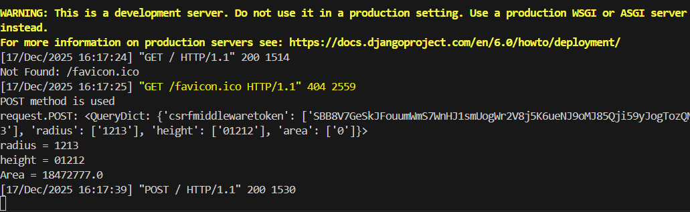
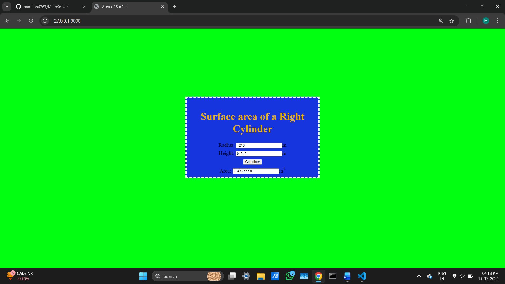

# Ex.04 Design a Website for Server Side Processing
## Date: 17-12-2025

## AIM:
 To design a website to calculate the power of a lamp filament in an incandescent bulb in the server side. 


## FORMULA:
P = I<sup>2</sup>R
<br> P --> Power (in watts)
<br> I --> Intensity
<br> R --> Resistance

## DESIGN STEPS:

### Step 1:
Clone the repository from GitHub.

### Step 2:
Create Django Admin project.

### Step 3:
Create a New App under the Django Admin project.

### Step 4:
Create python programs for views and urls to perform server side processing.

### Step 5:
Create a HTML file to implement form based input and output.

### Step 6:
Publish the website in the given URL.

## PROGRAM :
```html
<!DOCTYPE html>
<html>
<head>
<meta charset='utf-8'>
<meta http-equiv='X-UA-Compatible' content='IE=edge'>
<title>Area of Surface</title>
<meta name='viewport' content='width=device-width, initial-scale=1'>
<style type="text/css">
body {
    background-color: #00ff11;
}
.edge {
    width: 100%;
    padding-top: 250px;
    text-align: center;
}
.box {
    display: inline-block;
    border: thick dashed #ffffff;
    width: 500px;
    min-height: 300px;
    font-size: 20px;
    background-color: rgb(23, 53, 222);
}
.formelt {
    color: rgb(9, 10, 11);
    text-align: center;
    margin-top: 7px;
    margin-bottom: 6px;
}
h1 {
    color: rgb(227, 176, 11);
    padding-top: 20px;
}

</style>
</head>
<body>
<div class="edge">
    <div class="box">
        <h1>Surface area of a Right Cylinder</h1>
   <form method="POST">
            
            <div class="formelt">
                Radius: <input type="text" name="radius" value="{{r}}">m<br/>
            </div>
            <div class="formelt">
                Height: <input type="text" name="height" value="{{h}}">m<br/>
            </div>
            <div class="formelt">
                <input type="submit" value="Calculate"><br/>
            </div>
            <div class="formelt">
                Area: <input type="text" name="area" value="{{area}}">m<sup>2</sup><br/>
            </div>
        </form>
    </div>
</div>
</body>
</html>

```
```python
views.py
from django.shortcuts import render

def surfacearea(request):
    context = {}
    context['area'] = "0"
    context['r'] = "0"
    context['h'] = "0"
    
    if request.method == 'POST':
        print("POST method is used")
        
        print('request.POST:', request.POST)
        
        r = request.POST.get('radius', '0') 
        h = request.POST.get('height', '0') 
        print('radius =', r)
        print('height =', h)
        
        area = 2 * 3.14 * int(r) * int(h) + 2*3.14*int(r)*int(r)
        context['area'] = area
        context['r'] = r
        context['h'] = h
        print('Area =', area)
    
    return render(request, 'myapp/math.html', context)
urls.py

from django.contrib import admin
from django.urls import path

from myapp import views
urlpatterns = [
    path('admin/', admin.site.urls),
    path('areaofsurface/',views.surfacearea,name="areaofsurface"),
    path('',views.surfacearea,name="areaofsurfaceroot")
]

settings.py


from pathlib import Path
import os

# Build paths inside the project like this: BASE_DIR / 'subdir'.
BASE_DIR = Path(__file__).resolve().parent.parent


# Quick-start development settings - unsuitable for production
# See https://docs.djangoproject.com/en/6.0/howto/deployment/checklist/

# SECURITY WARNING: keep the secret key used in production secret!
SECRET_KEY = 'django-insecure-1pskr11yigm91!$pt+%-tepao-=6q&gjp+3^xc)y!=q7ajvuoz'

# SECURITY WARNING: don't run with debug turned on in production!
DEBUG = True

ALLOWED_HOSTS = ['*']


# Application definition

INSTALLED_APPS = [
    'django.contrib.admin',
    'django.contrib.auth',
    'django.contrib.contenttypes',
    'django.contrib.sessions',
    'django.contrib.messages',
    'django.contrib.staticfiles',
    'myapp',
]

MIDDLEWARE = [
    'django.middleware.security.SecurityMiddleware',
    'django.contrib.sessions.middleware.SessionMiddleware',
    'django.middleware.common.CommonMiddleware',
    'django.middleware.csrf.CsrfViewMiddleware',
    'django.contrib.auth.middleware.AuthenticationMiddleware',
    'django.contrib.messages.middleware.MessageMiddleware',
    'django.middleware.clickjacking.XFrameOptionsMiddleware',
]

ROOT_URLCONF = 'myproject.urls'

TEMPLATES = [
    {
        'BACKEND': 'django.template.backends.django.DjangoTemplates',
        'DIRS': [],
        'APP_DIRS': True,
        'OPTIONS': {
            'context_processors': [
                'django.template.context_processors.request',
                'django.contrib.auth.context_processors.auth',
                'django.contrib.messages.context_processors.messages',
            ],
        },
    },
]

WSGI_APPLICATION = 'myproject.wsgi.application'


# Database
# https://docs.djangoproject.com/en/6.0/ref/settings/#databases

DATABASES = {
    'default': {
        'ENGINE': 'django.db.backends.sqlite3',
        'NAME': BASE_DIR / 'db.sqlite3',
    }
}


# Password validation
# https://docs.djangoproject.com/en/6.0/ref/settings/#auth-password-validators

AUTH_PASSWORD_VALIDATORS = [
    {
        'NAME': 'django.contrib.auth.password_validation.UserAttributeSimilarityValidator',
    },
    {
        'NAME': 'django.contrib.auth.password_validation.MinimumLengthValidator',
    },
    {
        'NAME': 'django.contrib.auth.password_validation.CommonPasswordValidator',
    },
    {
        'NAME': 'django.contrib.auth.password_validation.NumericPasswordValidator',
    },
]


# Internationalization
# https://docs.djangoproject.com/en/6.0/topics/i18n/

LANGUAGE_CODE = 'en-us'

TIME_ZONE = 'UTC'

USE_I18N = True

USE_TZ = True


# Static files (CSS, JavaScript, Images)
# https://docs.djangoproject.com/en/6.0/howto/static-files/

STATIC_URL = 'static/'
STATICFILES_DIRS=[
	os.path.join(BASE_DIR,'mathapp/static')
]

```
## SERVER SIDE PROCESSING:



## HOMEPAGE:



## RESULT:
The program for performing server side processing is completed successfully.
